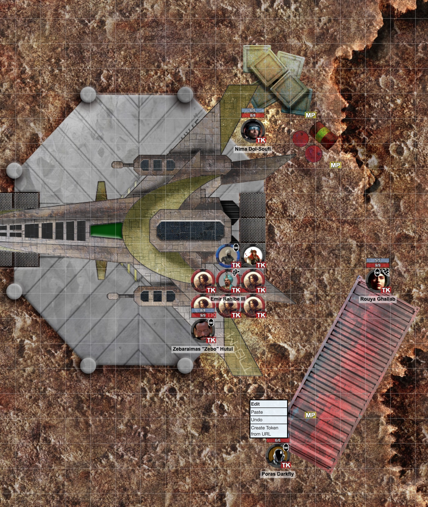

The party captured both the leader and a single soldier from the team that ambushed them in the hangar. After some interrogating and some deduction, the party determined that the soliders were part of the Nazareem's Sacrifice and sent by the Emir, who must also be part of Nazareem's Sacrifice. In addition, the whole research station seems setup to uncover Nazareem artifacts. 

With that in mind, the party decided to load up the remaining strike team members into stasis pods on the Narzalus and have Odella pilot it to the refueling platform in Dabaran's orbit. The robot would also be on board guarding the prisoners. Meanwhile, the rest of the group loaded up onto the _Dark Narzalus_ and dug through the ship's logs. They found one address contacted multiple times over the past 48 hours and gave it a call. A gruff voice answered and asked:

> Have you completed the job?

Odella managed to convince this person that they had _and_ got to talk to the Emir. Odella asked if the Emir would be willing to meet the strike team at the landing pad, as they had a find that they didn't trust to anyone else. The Emir reluctantly agreed and said he'd bring several latifs as his guard.

Meanwhile the team suited up in a combination of stealth suits and the strike teams' equipment. The characters in stealth suits found hiding places, though Nima was a bit late and did a convincing job of looking busy by investigating the ship. Zitane climbed on top of the ship.

The Emir approached Odella and they started to talk. Odella tried to get the Emir on board by himself, but the Latifs wouldn't allow it. It was at this point that Zitane jumped down from the top of the ship, mercurium blade in hand, and struck the Emir, grappling him. Two shots rang out from Poras and Rouya's guns, and Zebo ran forward and hit an unaware latif with his power sledge.
